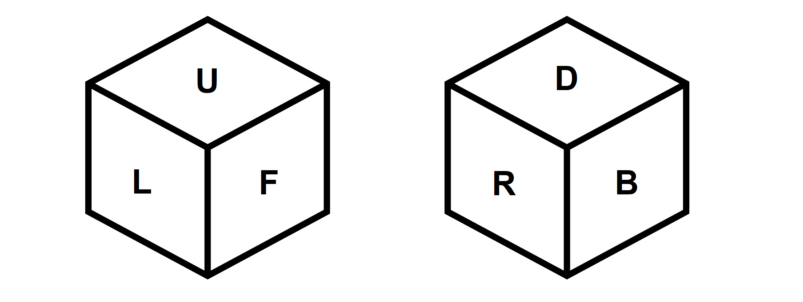

# Rubik's cube simulator

This is a [Rubik's cube](https://en.wikipedia.org/wiki/Rubik%27s_Cube) simulator written in java using the swing framework.

## Installation

Having [java 17.02](https://www.oracle.com/java/technologies/javase/jdk17-archive-downloads.html) (or higher) installed is required for the program to run.
A headless JRE will not be suitable since swing is used.

### For Linux:
1. Download linux.zip file found [here](https://github.com/MathewKJ2048/Rubiks-cube-simulator/tree/main/downloads).
2. Extract the contents.
3. Give __run.sh__ permission to execute.
4. Execute __run.sh__.

### For Windows:  
1. Download the windows.zip file found [here](https://github.com/MathewKJ2048/Rubiks-cube-simulator/tree/main/downloads).
2. Extract the contents.
3. Double-click __Rubik's cube simulator.exe__ to run the program.

### For OSX:

 ~~Go pound sand~~
download __Rubik's cube simulator.jar__ found [here](https://rebrand.ly/r1ckr0l13r) and execute it.

## Screenshots
---

---

---

## Notation

U – up  
D – down  
L – left  
R – right  
F – face  
B – back

Standard notation for Rubik’s cubes apply here:  
F rotates the face clockwise,
FI rotates the face anticlockwise
and so on.  
The clock is defined to be pasted on the visible part of the face being rotated.  
Thus R and L would rotate in two different directions when seen from the top.

TL (turn left) turns the cube such that F becomes L.  
TR (turn right) turns the cube such that F becomes R.  
RF (roll forward) turns the cube such that F becomes D.  
RB (roll back) turns the cube such that F becomes U.  

## Users' manual

### Input:
The commands can be input in two ways:
1) via the button pad and
2) via the input text area.

The input text area is case-insensitive.

### Commands:
`U` – up  
`UI` – up inverted  
`D` – down  
`DI` – down inverted  
`F` – face  
`FI` – face inverted  
`B` – back  
`BI` – back inverted  
`L` – left  
`LI` – left inverted  
`R` – right  
`RI` – right inverted  
`TL` – turn left  
`TR` – turn right  
`RF` – roll forward  
`RB` – roll back  
`SCR` – scramble 

### Log:
When a command is carried out, it is logged.
The log can be cleared with the __clear__ button found at the bottom.

### Solution:
The __solve__ button can be used to generate a solution for the given scrambled condition.
If the user wishes to see each move of the solution, the user may leave the __step__ radio button next to the __solve__ button marked.
The list of moves to solve the cube appear in the log text area after the solution is complete.

### Preferences:
Preferences may be edited by changing __config.json__ in program files.
The following preferences are editable:
1) scale: this value represents the size of the display area.
2) x: this value represents the x-co-ordinate of the centre of the left cube before scaling.
3) y: this value represents the x-co-ordinate of the centre of the left cube before scaling.
(Note that the y axis starts at the top-left corner of the display area and increases downwards)
4) distance: this value represents the distance between the left and right cubes before scaling.
5) framerate: this value represents the time in milliseconds between each subsequent repaint of the cube.
6) interval: this value represents the time in milliseconds between each subsequent move carried out by the auto-solver.
It is recommended that framerate always be less than interval.

## Guide to source code
The cube consists of a 3-D array of blocks, where each block consists of 6 faces.
The classes [Block](https://github.com/MathewKJ2048/Rubiks-cube-simulator/blob/main/src/cube/Block.java) and [Cube](https://github.com/MathewKJ2048/Rubiks-cube-simulator/blob/main/src/cube/Block.java) found in the package cube contain the implementation of this logic.
A single __3×3×3__ array was chosen over 6 different __3×3__ arrays for ease of visualization while writing code.

The classes in package cube as well as the class [Cube_solver](https://github.com/MathewKJ2048/Rubiks-cube-simulator/blob/main/src/Cube_solver.java) were written in 2016 by someone (a younger, less experienced me) who did not fully appreciate the importance of commenting their code. As such, I do not currently understand most of what is written and cannot explain in detail the logic used. The solution algorithm used is the beginners’ algorithm where one solves the cube one layer at a time, from the top (white) to the bottom (yellow).

The GUI is made up of two components, a form file and a class. The form file was created using the community edition of IntelliJ and bound to the class.
1. Default values for the parameters can be found in the first few lines of class [GUI_Cube](https://github.com/MathewKJ2048/Rubiks-cube-simulator/blob/main/src/GUI_Cube.java).
2. The function rewrite_config() attempts to create config.json if config.json is corrupted or missing. It is called in the function load_preferences() in the same class.
3. The colours used for the cube can be found in the get_colour(char) function inside the nested class DrawPanel inside the createUIcomponents() function.
4. The look and feel of the application is set by default to the Nimbus look and feel. This can be changed by editing main(String[]) in class [Main](https://github.com/MathewKJ2048/Rubiks-cube-simulator/blob/main/src/Main.java).

The [Test](https://github.com/MathewKJ2048/Rubiks-cube-simulator/blob/main/src/Test.java) class was written for carrying out certain tests, like seeing how many times a sequence of moves needs to be repeated before the cube returns to its original configuration, and the time taken by the algorithm used to solve the cube (by subtracting the time taken to scramble the cube n times from the time taken to solve and scramble the cube n times and dividing by n, where n is a large number).

## Credits
- Cube design: [Mathew K J](https://github.com/MathewKJ2048) 
- Solution: [Mathew K J](https://github.com/MathewKJ2048)
- icon design: [Mathew K J](https://github.com/MathewKJ2048)
- UI/UX design: [Mathew K J](https://github.com/MathewKJ2048)
- Art design: [Mathew K J](https://github.com/MathewKJ2048)
- Documentation: [Mathew K J](https://github.com/MathewKJ2048)

The following software was used in this project:

- [BlueJ](https://www.bluej.org/)
- [IntelliJ IDEA Community edition](https://www.jetbrains.com/idea/)
- [Inkscape](https://inkscape.org/)
- [launch4j](http://launch4j.sourceforge.net/)
